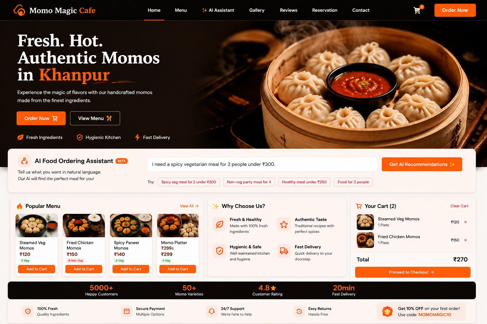

# 🥟 Momo Magic Cafe

> A modern, responsive restaurant and food-ordering website built with HTML, CSS and JavaScript, enhanced with an AI-powered food recommendation assistant.

[🌐 Live Demo](https://momo-magic-cafe.netlify.app)

---

## 📸 Preview



---

## ✨ Features

### 🤖 AI Food Ordering Assistant

- 💬 Natural-language food ordering
- 💰 Budget-aware recommendations
- 👥 Group-size based recommendations
- 🥦 Veg / Non-veg preference detection
- 🌶️ Taste-based recommendations
- 🎯 Personalized menu suggestions
- 🔎 AI-powered product discovery
- 🛒 Add recommended meals directly to cart
- ⚡ Faster and personalized ordering experience

### 🍽️ Restaurant Features

- 🍽️ Interactive restaurant menu
- 🛒 Shopping cart functionality
- 📦 Food ordering experience
- 📱 Fully responsive design
- 🎨 Modern premium UI
- 🖼️ Food gallery
- ⭐ Customer reviews section
- 📞 Contact section
- 🪑 Table reservation interface
- ⚡ Interactive JavaScript functionality

---

## 🛠️ Tech Stack

| Technology | Usage |
|---|---|
| HTML5 | Website structure |
| CSS3 | Styling & responsive design |
| JavaScript | Interactions, AI recommendation logic & functionality |

---

## 🤖 AI Food Ordering Assistant

The AI Food Ordering Assistant allows customers to describe their food requirements in natural language.

For example:

> "I need a spicy vegetarian meal for 2 people under ₹300."

The assistant analyzes the customer's requirements including:

- Budget
- Number of people
- Dietary preference
- Taste preference

It then provides personalized menu recommendations and allows users to add the recommended meal directly to their shopping cart.

### 🎯 Commerce Benefits

- AI-powered product discovery
- Natural-language recommendations
- Personalized suggestions
- Budget-aware food recommendations
- Faster ordering experience
- Improved customer conversion potential

---

## 🌐 Live Demo

### 👉 [Visit Momo Magic Cafe](https://momo-magic-cafe.netlify.app)

---

## 📂 Project Structure

```text
momo-magic-cafe/
│
├── .vscode/
├── image/
├── index.html
├── style.css
├── script.js
└── README.md